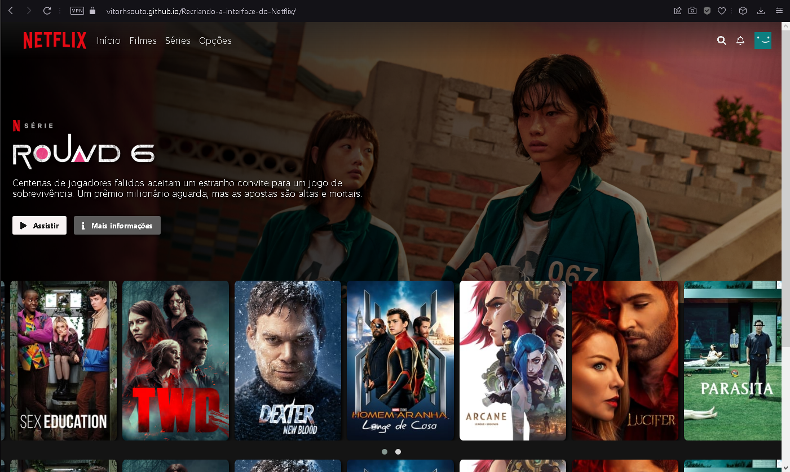

# Recriando a interface do Netflix

## 📑 Sobre
Nesse projeto foi reconstruído a interface do Netflix dentro do bootcamp HTML Web Developer.

## 🖌️ Resultado

## 💻 Tecnologias utilizadas
* HTML 5.
* CSS
* Java Script
* JQuery

### Feito por Vitor Souto
